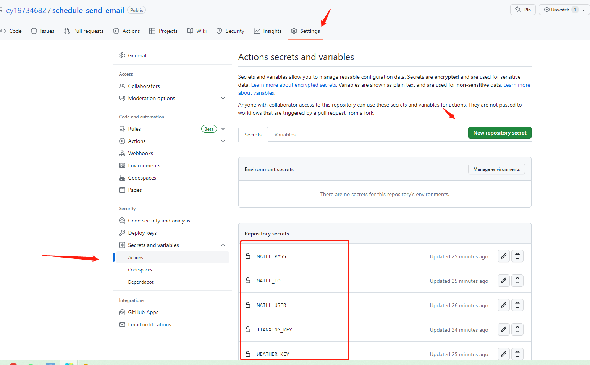
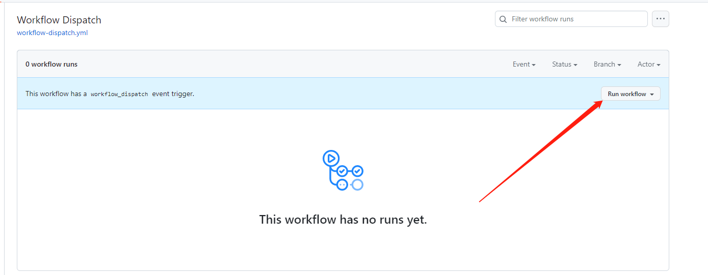

# Github Actions定时任务自动发送邮件
## 使用说明
### 1、配置环境变量
将`.env.example`复制到同目录下，重命名为`.env`，并填写对应变量
### 2、安装依赖并启动发送邮件操作
````
npm install

npm run serve
````

## 定时任务配置
在 `Settings ——> Secrets and variables ——> Actions` 点击`New repository secret`创建`secrets`


## 手动发送邮件
在`Actions`中选择`手动发送`点击`Run workflow`执行邮件发送

